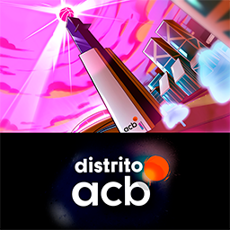

# Distrito ACB

<h1 align="center">
   
  
</h1>

Repositorio del juego Distrito ACB disponible en [Android](https://play.google.com/store/apps/details?id=com.distritoacb&hl=en&gl=US/ "Descargar Distrito ACB para Android") and pronto en iOS.

Este es un juego Play2Earn (con motivo de la Liga Endesa) donde puedes administrar una ciudad donde el basketball es el rey, puedes retar a otros jugadores, y recolectar ACBCoins (Monedas de juego) para comprar tokens (también conocidos como Cartas), estas cartas son de los jugadores de la liga ACB y de sus "Highlights" o mejores momentos. Para más información acerca del juego haz clic [aquí](https://www.acb.com/articulo/ver/338806-bienvenidos-al-distrito-del-entretenimiento.html/ "Página principal de ACB")

## Dependencias

* [Unity 2020.3.26f](https://unity3d.com/get-unity/download/archive/ "Página de descarga de versiones de Unity 2020")
* [Vuforia 10.5.5](https://developer.vuforia.com/vui/auth/login?url=/downloads/SDK%3Fd%3Dwindows-4893060-16-11927%26retU/ "Página de descarga de Vuforia")
* [Firebase 8.9.0 (Messaging and Analitycs)](https://firebase.google.com/docs/unity/setup/ "Página de descarga de Firebase")
* [QR Code/Barcode Scanner and Generator--Cross Platform(Pro) 5.4.4](https://assetstore.unity.com/packages/tools/integration/qr-code-barcode-scanner-and-generator-cross-platform-pro-56083/ "Link del asset store del plugin de scan y generador de QR (Pago)")
* [UniWebView4- 4.11.2](https://assetstore.unity.com/packages/tools/network/uniwebview-4-175993/ "Link del asset store de UniWebView (Pago)")
* [Doxygen 1.0.0](http://www.jacobpennock.com/Blog/unity-automatic-documentation-generation-an-editor-plugin/ "Página de descarga de Doxygen para Unity")
* [Json.NET 13.0.1](https://assetstore.unity.com/packages/tools/input-management/json-net-for-unity-11347/ "Link del asset store de Json.NET")
* [Unity UI Extensions 2.2.5](https://github.com/Unity-UI-Extensions/com.unity.uiextensions/ "Clone Unity UI Extensions")

## ¿Cómo instalar el proyecto?

1. Debes clonar el proyecto en tu PC
<h1 align="center">
   
  
</h1>
2. Instalar Unity 2020.3.26f con los módulos de exportación de Android y iOS en Unity Hub en la pestaña de "Installs"
<h1 align="center">
   
  
</h1>
<h1 align="center">
   
  
</h1>
3. Una vez clonado el proyecto y Unity instalado, abrir Unity Hub y estando en la pestaña "Projects" seleccionar la flecha en la opción de "Open" y seleccionar la opción "Add project from disk"
<h1 align="center">
   
  
</h1>
4. Al seleccionar esta opción te mostrará el explorador de archivos, es importante que busques la ruta donde clonaste el repo, una vez la encuentres selecciona la carpeta donde se encuentran las carpetas "Assets", "Packages", "Project Settings", etc...
<h1 align="center">
   
  
</h1>
5. Ya con el proyecto añadido a Unity Hub seleccionalo y abrelo con la versión de Unity 2020.3.26f (En caso de salir una alerta, selecciona la opción de abrir en Unity 2020.3.26f)
<h1 align="center">
   
  
</h1>
6. En caso de salirte una alerta mientras abre por primera vez el proyecto, relacionada al Package Manager selecciona la opción de Upgrade y Continuar, una vez seleccionadas estas opciones, el proyecto debe terminar de cargar y abrirse
7. En caso de salir errores en consola relacionados a Vuforia o Firebase, primero se debe limpiar la consola de Unity, en caso de persistir los errores es importante entrar a la carpeta Plugins en la raiz del proyecto y buscar ahí las carpetas correspondientes para descargar e instalar los plugins dentro del proyecto Unity
<h1 align="center">
   
  
</h1>

## Documentación del proyecto

Para encontrar la documentación del proyecto debes ubicarte en la raiz del repositorio y buscar en esta ruta ["Proyecto-ACB/Docs/html/index.html"](Docs/html)

## Patrones de diseño de software

* [Modelo–vista–controlador](https://es.wikipedia.org/wiki/Modelo%E2%80%93vista%E2%80%93controlador)
* [Singleton](https://es.wikipedia.org/wiki/Singleton)
